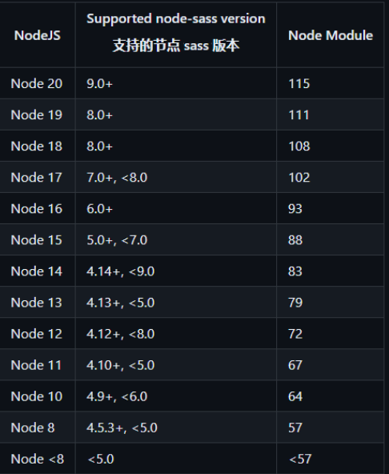

# yt-ui组件库
vue后台系统常用的组件

* [demo](https://programmermao-001.github.io/use-yt-ui/)
* [源码地址](https://github.com/ProgrammerMao-001/yt-ui)
* [文档地址](https://programmermao-001.github.io/yt-ui-doc/)

### 使用前须知
```
1. 目前只支持vue2.x 版本，vue3以上版本暂不支持
2. 使用时请务确保node_modules中存在如下依赖
3. 组件库中所有的样式命名规则为： yt-组件名称(-yt) 
    3.1 如文件名为：ytDemo 则外层样式类名为：yt-demo，以此类推
4. 所有组件的demo都存放在examples文件夹中
```

### 安装 
``` 
建议node14及以上版本（本人v14.16.1）
npm install node-sass@4.14.1 --save-dev
npm install sass-loader@8.0.0 --save-dev
```

### node 对应版本可参照下表


### 文件介绍
``` 
components文件夹 ---> 存放所有的组件
examples文件夹 ---> 存放组件的demo(组件如何使用)
public文件夹 ---> 存放组件的静态资源
```

### 发布流程
``` 
 todo: 更新 readeMe.md、package.json版本号   
 1. npm run lib   
 2. npm get registry 
 3. npm login
 4. npm publish --access public
```

### 如何使用
```
 1. 安装  
    npm i @mhfwork/yt-ui --save-dev
 
 2. main.js 中注册
    import ytComp from "@mhfwork/yt-ui/components/ytComp";
    import ytDemo from "@mhfwork/yt-ui/components/ytDemo";
    Vue.use(ytComp)
    Vue.use(ytDemo)
 
 3. vue文件中使用
    <yt-comp page-name="pageName"/>
    <yt-demo />
```

### 开发中...
```
 1. ytChooseDialog 人员选择器（弹窗形式）
 2. ytNewPage（快速搭建 搜索栏 + 表格 + 分页的页面） 
```
